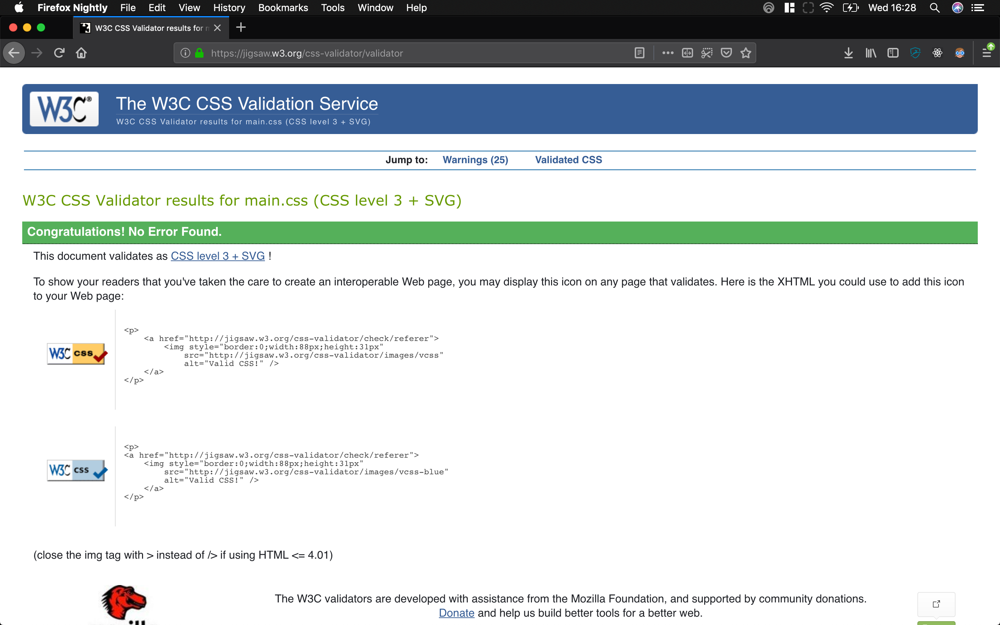

# Nikolas's Personal Site

## Runing the Site

All code is compiled into `build/`, just open up the index file in the browser.<sup>1</sup>

If you want to edit the site, edit the code in source, that way you have acsses to all the CSS classes.

When you are done edititng you can compile it by running

```
npm run build
```
from the root directory


## Validations

build/index.html =>


build/projects.html =>


build/resume.html =>


build/main.css =>



---

<sup>1</sup>=> The site should self host in V2